# Microsoft Agent Framework Demos - Roadmap & Progress Tracker

This document tracks the progressive complexity demonstrations for the Microsoft Agent Framework, serving as both a planning guide and progress index.

## Overview

Each demo builds incrementally on previous ones, adding new concepts and complexity while maintaining working implementations.

---

## ✅ Demo 1: Simple Sequential Workflow

**Status**: COMPLETED

**Complexity Level**: Basic

**Concepts Demonstrated**:
- Sequential executor chaining
- Basic `Executor<TInput, TOutput>` pattern
- Simple message passing with `AddEdge()`
- Single-path workflow execution
- Basic console output

**Implementation**:
- InputAgent → ProcessorAgent → OutputAgent
- Straightforward linear execution
- No branching or parallelism

**Files**:
- `demo1/demo1/Program.cs`
- `demo1/README.md`

---

## ✅ Demo 2: Parallel Execution with Conditional Branching

**Status**: COMPLETED

**Complexity Level**: Intermediate

**Concepts Demonstrated**:
- ✅ **Parallel fan-out** with `AddFanOutEdge()`
- ✅ **Stateful aggregation** pattern (custom collector)
- ✅ **Conditional branching** with `AddSwitch()` and predicate-based routing
- ✅ **Multiple terminal executors** with `WithOutputFrom()`
- ✅ **Proper output handling** (avoiding duplicate yields)
- ✅ **Event streaming** with `WorkflowOutputEvent`
- ✅ **SuperStep-based execution** model

**Implementation**:
- DummyInput → [Writer1, Writer2] (parallel)
- Writers → Aggregator (stateful collection)
- Aggregator → Selector (dual invocations)
- Selector → {Approver | Rejector} (conditional)
- Both terminal executors yield outputs

**Key Learnings**:
- `WithOutputFrom()` auto-yields return values (no manual `YieldOutputAsync()` needed)
- Stateful executors called once per incoming edge
- Dual selector invocations enable both branches to execute
- Framework behavior: Both conditional paths can execute simultaneously

**Files**:
- `demo2/demo2/Program.cs`
- `demo2/README.md` (comprehensive with official docs research)

---

## 🗺️ Strategic Roadmap: The "Killing Features" Journey

This comprehensive roadmap outlines the path to mastering the Microsoft Agent Framework, covering all critical capabilities from basic orchestration to enterprise-grade production systems.

### Phase 1: The Mechanics (✅ Completed)
*Goal: Master the fundamental building blocks of workflows.*

- **Demo 1: Sequential Workflow** (✅ Done)
  - **Concept**: Linear chaining (`A -> B -> C`).
  - **Feature**: `Executor<T>`, `AddEdge`.
- **Demo 2: Parallel & Branching** (✅ Done)
  - **Concept**: Doing things at once & making decisions.
  - **Feature**: `AddFanOutEdge` (Parallelism), `AddSwitch` (Conditional Logic), Stateful Aggregation.
- **Demo 3: Iterative Feedback Loops** (✅ Done)
  - **Concept**: Self-correction and refinement.
  - **Feature**: Cyclic Graphs, Loop Termination, Type Adaptation in cycles.

### Phase 2: Reliability & Persistence (The "Enterprise Basics")
*Goal: Build systems that survive failures and wait for humans.*

- **Demo 4: Human-in-the-Loop & Persistence** (Next)
  - **Concept**: The "Pause Button" and "Save Game" feature.
  - **Features**:
    - **Checkpointing**: Saving workflow state to disk/DB.
    - **Resuming**: Restarting a workflow from where it left off.
    - **Human Approval**: Pausing execution until a human signal is received.
  - **Technical Feasibility**: ✅ **Supported**.
    - APIs: `CheckpointManager`, `RequestPort<T>`, `InProcessExecution.StreamAsync(..., checkpointManager)`.
  - **Why**: Essential for long-running business processes (e.g., Expense Approval).

- **Demo 5: Error Handling & Resilience**
  - **Concept**: "Graceful Failure".
  - **Features**:
    - **Retries**: Implementing retry logic within Executors.
    - **Fallbacks**: Routing to a backup agent if the primary fails.
  - **Technical Feasibility**: ⚠️ **Custom Implementation**.
    - APIs: No built-in retry policy. Must use **Polly** or custom `try/catch` loops inside `HandleAsync`.
  - **Why**: Production systems must handle API outages and transient errors.

### Phase 3: Intelligence & Capabilities (The "Brain")
*Goal: Injecting real AI and agency.*

- **Demo 6: AI Integration & Tool Calling**
  - **Concept**: "Real Agents" doing real work.
  - **Features**:
    - **ChatClientAgent**: Integrating Azure OpenAI / OpenAI models.
    - **Tool Use**: Giving agents "hands" (Calculator, Web Search).
  - **Technical Feasibility**: ✅ **Supported**.
    - APIs: `ChatClientAgent`, `AIFunctionFactory`, `IChatClient`.
  - **Why**: Moving from "Dummy" string processing to actual intelligence.

- **Demo 7: Memory & Context Management**
  - **Concept**: "Remembering the Past".
  - **Features**:
    - **Long-term Memory**: RAG (Retrieval Augmented Generation) integration.
  - **Technical Feasibility**: 🔌 **External Integration**.
    - APIs: Requires **Semantic Kernel** (`TextSearchProvider`, `Mem0Provider`) or custom vector DB integration. MAF provides the agent shell, SK provides the memory.
  - **Why**: Complex tasks require context beyond the immediate prompt.

### Phase 4: Advanced Patterns (The "Expert" Level)
*Goal: Sophisticated multi-agent collaboration.*

- **Demo 8: Dynamic Planning (ReAct)**
  - **Concept**: "Don't follow the script, write it."
  - **Features**:
    - **Planner Agent**: An agent that generates the workflow steps at runtime.
  - **Technical Feasibility**: ⚠️ **Custom Implementation**.
    - APIs: No `Planner` class. Must implement **ReAct pattern** manually or use **Magentic** libraries.
  - **Why**: Handling ambiguous or open-ended user requests.

- **Demo 9: Multi-Agent Collaboration Patterns**
  - **Concept**: "Two heads are better than one."
  - **Features**:
    - **Debate/Voting**: Multiple agents voting on the best output.
  - **Technical Feasibility**: ✅ **Supported**.
    - APIs: `BuildGroupChat()`, `BuildConcurrent()`, `BuildHandoff()`.
  - **Why**: Improving accuracy and reducing hallucinations.

### Phase 5: Production Readiness (The "Deployment")
*Goal: Shipping it.*

- **Demo 10: Hosting & API Exposure**
  - **Concept**: "Agents as a Service".
  - **Features**:
    - **ASP.NET Core Integration**: Hosting workflows in a Web API.
  - **Technical Feasibility**: ✅ **Supported**.
    - APIs: Standard .NET DI, `InProcessExecution` is thread-safe.
  - **Why**: Users interact via Apps/Web, not Console.

- **Demo 11: Observability & Monitoring**
  - **Concept**: "X-Ray Vision".
  - **Features**:
    - **OpenTelemetry**: Distributed tracing of agent interactions.
  - **Technical Feasibility**: ✅ **Supported**.
    - APIs: Native `ActivitySource` support in MAF.
  - **Why**: You can't fix what you can't see.

### Phase 6: Scale (The "Future")
*Goal: Massive scale.*

- **Demo 12: Distributed Agents**
  - **Concept**: "Agents Everywhere".
  - **Features**:
    - **Orleans Integration**: Virtual Actors.
  - **Technical Feasibility**: 🔌 **Extension Required**.
    - APIs: Use `Microsoft.Agents.Orleans` extension (Azure Functions).
  - **Why**: Handling millions of concurrent workflows.

---

## 📚 Research Notes & Potential Options

(Preserved for reference)

### Option 1: Multi-Level Workflow with Feedback Loops ✅
**Feasibility**: ✅ **STRONG OFFICIAL SUPPORT**

**Concepts**:
- Iterative refinement with feedback loops
- Revision tracking in executor state
- Iteration limit controls
- Cycle detection in workflow graphs

**Use Case**: Rejected slogans → RevisionAgent → re-submit to Selector → iterate until approved or max iterations

**Official Framework Support**:
- ✅ **RequestPort Pattern**: Pause/resume workflows for human-in-the-loop or external processing ([Requests & Responses](https://learn.microsoft.com/en-us/agent-framework/tutorials/workflows/requests-and-responses))
- ✅ **Magentic Orchestration**: "Iterative refinement through agent collaboration" explicitly supported ([Magentic](https://learn.microsoft.com/en-us/agent-framework/user-guide/workflows/orchestrations/magentic))
- ✅ **Checkpointing**: State preserved across pause-resume cycles ([Checkpointing](https://learn.microsoft.com/en-us/agent-framework/tutorials/workflows/checkpointing-and-resuming))
- ✅ **Sample Code**: Human-in-the-Loop Guessing Game demonstrates loop pattern

**Key APIs**: `RequestPort`, `ctx.request_info()`, `send_responses_streaming()`, Magentic manager

---

### Option 2: Dynamic Fan-Out with Partitioning ✅
**Feasibility**: ✅ **STRONG OFFICIAL SUPPORT**

**Concepts**:
- `AddFanOutEdge()` with custom partitioner function
- Selective parallel processing based on content analysis
- Multiple writer pools (technical, marketing, creative)
- Dynamic routing based on input characteristics

**Use Case**: Analyze input → route to specialized writer teams → aggregate diverse responses

**Official Framework Support**:
- ✅ **Partitioner Functions**: Official samples show multi-selection routing with custom logic ([Workflow Branching](https://learn.microsoft.com/en-us/agent-framework/tutorials/workflows/workflow-with-branching-logic#multi-selection-edges))
- ✅ **Code Examples**: Email routing sample with spam/length-based partitioning
- ✅ **Syntax**: `AddFanOutEdge(source, partitioner: (msg, targetCount) => [...], targets: [...])`

**Key APIs**: `AddFanOutEdge()`, partitioner function returning `IEnumerable<int>`

---

### Option 3: Multi-Stage Pipeline with Checkpointing ✅
**Feasibility**: ✅ **STRONG OFFICIAL SUPPORT**

**Concepts**:
- Workflow state persistence
- Resumable workflows after failures
- `OnCheckpointingAsync()` override pattern
- Multi-stage approval pipeline

**Use Case**: Draft → Review → Edit → Approval → Publishing with state saved at each stage

**Official Framework Support**:
- ✅ **CheckpointManager**: `CheckpointManager.Default` or custom with JSON serialization ([Checkpointing](https://learn.microsoft.com/en-us/agent-framework/tutorials/workflows/checkpointing-and-resuming))
- ✅ **Automatic Checkpoints**: Created at end of each superstep
- ✅ **State Persistence**: Executor state, pending messages, requests/responses all saved
- ✅ **Resume/Rehydrate**: Both same-run resume and new-instance rehydration supported

**Key APIs**: `CheckpointManager`, `OnCheckpointingAsync()`, `OnCheckpointRestoredAsync()`, `InProcessExecution.StreamAsync(workflow, input, checkpointManager)`

---

### Option 4: AI-Powered Executors ✅ (⭐ RECOMMENDED)
**Feasibility**: ✅ **STRONG OFFICIAL SUPPORT**

**Concepts**:
- `ChatClientAgent` integration with Azure OpenAI
- Real LLM-based content generation
- Agent middleware for logging/monitoring
- Structured output parsing from AI responses
- `AIAgent` vs custom `Executor` patterns

**Use Case**: Real AI generates creative slogans → AI evaluates quality → AI refines based on feedback

**Official Framework Support**:
- ✅ **ChatClientAgent**: Native integration with `IChatClient` ([Chat Client Agent](https://learn.microsoft.com/en-us/agent-framework/user-guide/agents/agent-types/chat-client-agent))
- ✅ **Azure OpenAI**: First-class support with authentication samples ([Azure OpenAI Agent](https://learn.microsoft.com/en-us/agent-framework/user-guide/agents/agent-types/azure-openai-chat-completion-agent))
- ✅ **Workflow Integration**: Agents can be added directly to workflows via edges
- ✅ **Streaming Support**: Both `RunAsync()` and `RunStreamingAsync()` available

**Key APIs**: `ChatClientAgent(chatClient, instructions, name)`, `WorkflowBuilder.AddEdge(agent1, agent2)`, `TurnToken`

**Why Recommended**: 
- Demonstrates real-world AI agent orchestration
- Shows practical LLM integration patterns
- Builds on demo2's structure with actual intelligence
- Highly relevant to production scenarios

---

### Option 5: Complex Aggregation Patterns ✅
**Feasibility**: ✅ **STRONG OFFICIAL SUPPORT**

**Concepts**:
- Heterogeneous result aggregation (different types)
- Weighted voting mechanisms
- Consensus algorithms across agents
- Partial result handling with timeouts

**Use Case**: Multiple AI agents vote on best slogan → weighted scoring → consensus selection

**Official Framework Support**:
- ✅ **Concurrent Orchestration**: Automatic aggregation of diverse agent outputs ([Concurrent](https://learn.microsoft.com/en-us/agent-framework/user-guide/workflows/orchestrations/concurrent))
- ✅ **Custom Aggregators**: Override default list aggregation with domain-specific logic
- ✅ **Union Types**: Framework handles mixed result types (`int | float`, etc.)
- ✅ **Fan-In Edges**: `AddFanInEdge(aggregator, sources: [agent1, agent2, agent3])`

**Key APIs**: `AgentWorkflowBuilder.BuildConcurrent()`, `AddFanInEdge()`, custom aggregator executors

---

### Option 6: Event-Driven Architecture ✅ (⭐ RECOMMENDED)
**Feasibility**: ✅ **STRONG OFFICIAL SUPPORT**

**Concepts**:
- Custom workflow events (e.g., `DatabaseEvent`, `ProgressEvent`)
- Event subscribers for monitoring
- Progress tracking with percentage complete
- Real-time observability patterns

**Use Case**: Emit progress events throughout workflow → subscribers log/monitor → dashboard updates

**Official Framework Support**:
- ✅ **Custom Events**: Inherit from `WorkflowEvent` and emit with `ctx.AddEventAsync()` ([Events](https://learn.microsoft.com/en-us/agent-framework/user-guide/workflows/core-concepts/events))
- ✅ **Built-in Events**: `WorkflowStartedEvent`, `WorkflowOutputEvent`, `ExecutorInvokeEvent`, `ExecutorCompleteEvent`, `RequestInfoEvent`
- ✅ **Event Streaming**: `await foreach (var evt in run.WatchStreamAsync())`
- ✅ **Observability**: OpenTelemetry integration with custom spans, logs, metrics

**Key APIs**: `WorkflowEvent`, `ctx.AddEventAsync()`, `setup_observability()`, custom event classes

**Why Recommended**:
- Complements AI agent pattern (Option 4)
- Demonstrates production observability
- Shows extensibility of framework
- Practical for monitoring complex workflows

---

### Option 7: Error Handling and Resilience ⚠️
**Feasibility**: ⚠️ **PARTIAL SUPPORT** (No built-in retry/fallback, use workflow graph patterns)

**Concepts**:
- Retry logic for failed executors
- Fallback paths in workflow graph
- Graceful degradation patterns
- Timeout handling for long operations
- Error event propagation

**Use Case**: AI call fails → retry 3 times → fallback to simpler agent → log errors

**Official Framework Support**:
- ✅ **Error Events**: `WorkflowErrorEvent` emitted on failures ([Events](https://learn.microsoft.com/en-us/agent-framework/user-guide/workflows/core-concepts/events))
- ⚠️ **Retry Logic**: No built-in retry mechanism; implement via custom executor logic and state
- ⚠️ **Fallback Paths**: Use conditional edges to route to fallback executors based on error state
- ❓ **Timeout Handling**: Not documented; would require custom implementation
- ✅ **Error Propagation**: Exceptions bubble up through workflow event stream

**Implementation Strategy**:
- Custom retry executor wrapper tracking attempt count
- Conditional edges routing to fallback based on failure flag
- Manual timeout tracking in executor state

**Note**: Framework focuses on explicit workflow graphs rather than hidden retry logic. Resilience implemented through graph topology.

---

### Option 8: Multi-Output Streaming ✅
**Feasibility**: ✅ **STRONG OFFICIAL SUPPORT**

**Concepts**:
- Multiple `YieldOutputAsync()` calls per executor
- Streaming intermediate results
- Progress reporting from long-running agents
- When to use manual yield vs `WithOutputFrom()`

**Use Case**: AI agent yields draft → yields revision → yields final → all captured as workflow outputs

**Official Framework Support**:
- ✅ **YieldOutputAsync**: `ctx.YieldOutputAsync(output)` can be called multiple times per executor ([API Docs](https://learn.microsoft.com/en-us/dotnet/api/microsoft.agents.ai.workflows.iworkflowcontext.yieldoutputasync))
- ✅ **WorkflowOutputEvent**: Each yield emits separate output event
- ✅ **Streaming Execution**: `StreamAsync()` captures all yields in real-time
- ✅ **Official Guidance**: Manual yield appropriate for intermediate progress, multi-step results

**Key APIs**: `ctx.YieldOutputAsync()`, `WorkflowOutputEvent`, avoid mixing with `WithOutputFrom()` on same executor

**Best Practices** (from demo2 research):
- Use `WithOutputFrom()` alone for terminal executors with single output
- Use manual `YieldOutputAsync()` for intermediate/multi-output scenarios
- Never combine both (causes duplicate outputs)

---

## 💡 Recommended Demo 3 Implementation

**Demo 3: "AI-Powered Multi-Agent Workflow with Custom Events"**

**Combines**: Option 4 (AI Agents) + Option 6 (Event-Driven)

**Proposed Architecture**:
```
Input → [AI Writer 1, AI Writer 2, AI Writer 3] (parallel with real LLMs)
  ↓
Aggregator (collects AI-generated slogans)
  ↓
AI Evaluator (uses LLM to score slogans)
  ↓
Selector (picks highest scored)
  ↓
{AI Refiner | DirectPublish} (conditional)
  ↓
FinalOutput

Throughout: Custom events for progress, AI token usage, timing
```

**New Concepts**:
- Real Azure OpenAI integration
- `ChatClientAgent` usage
- Custom event types (ProgressEvent, TokenUsageEvent)
- Structured output from LLMs
- Agent middleware patterns
- Observable AI orchestration

**Benefits**:
- Realistic production-like workflow
- Demonstrates practical AI agent patterns
- Shows monitoring/observability
- Builds naturally on demo2's foundation
- Highly relevant for modern AI applications

---

## Future Considerations (Demo 4+)

### Demo 4: Agent-to-Agent (A2A) Communication
- A2A protocol integration
- Remote agent discovery
- Cross-service agent orchestration
- Distributed workflows

### Demo 5: Handoff Orchestration
- Agent handoff patterns
- Conversation routing
- Context preservation across handoffs
- Multi-agent collaboration

### Demo 6: Advanced Checkpointing & Recovery
- State persistence to external storage
- Workflow resume from checkpoint
- Long-running workflow patterns
- Distributed state management

---

## Research Resources

All demos reference official Microsoft Agent Framework documentation:
- [Agent Framework User Guide](https://learn.microsoft.com/en-us/agent-framework/user-guide/overview)
- [Workflow Core Concepts](https://learn.microsoft.com/en-us/agent-framework/user-guide/workflows/core-concepts/overview)
- [Executor Documentation](https://learn.microsoft.com/en-us/agent-framework/user-guide/workflows/core-concepts/executors)
- [API Reference](https://learn.microsoft.com/en-us/dotnet/api/microsoft.agents.ai.workflows)

---

## Progress Summary

| Demo    | Status     | Complexity   | Key Focus              |
| ------- | ---------- | ------------ | ---------------------- |
| Demo 1  | ✅ Complete | Basic        | Sequential workflows   |
| Demo 2  | ✅ Complete | Intermediate | Parallel + Conditional |
| Demo 3  | 🚧 Planning | Advanced     | AI Agents + Events     |
| Demo 4+ | 📋 Future   | Expert       | A2A, Handoffs, etc.    |

---

## Roadmap Diagram

```mermaid
graph TD
    subgraph Phase1["Phase 1: The Mechanics"]
        D1["Demo 1: Sequential Workflow"]
        D2["Demo 2: Parallel & Branching"]
        D3["Demo 3: Iterative Feedback Loops"]
    end
    subgraph Phase2["Phase 2: Reliability & Persistence"]
        D4["Demo 4: Human-in-the-Loop & Persistence"]
        D5["Demo 5: Error Handling & Resilience"]
    end
    subgraph Phase3["Phase 3: Intelligence & Capabilities"]
        D6["Demo 6: AI Integration & Tool Calling"]
        D7["Demo 7: Memory & Context Management"]
    end
    subgraph Phase4["Phase 4: Advanced Patterns"]
        D8["Demo 8: Dynamic Planning (ReAct)"]
        D9["Demo 9: Multi-Agent Collaboration Patterns"]
    end
    subgraph Phase5["Phase 5: Production Readiness"]
        D10["Demo 10: Hosting & API Exposure"]
        D11["Demo 11: Observability & Monitoring"]
    end
    subgraph Phase6["Phase 6: Scale"]
        D12["Demo 12: Distributed Agents"]
    end
    Phase1 --> Phase2 --> Phase3 --> Phase4 --> Phase5 --> Phase6
    classDef phase1 fill:#FF6B6B,stroke:#333,stroke-width:2px
    classDef phase1shade fill:#FF8E8E,stroke:#333
    classDef phase2 fill:#4ECDC4,stroke:#333,stroke-width:2px
    classDef phase2shade fill:#6ED7CE,stroke:#333
    classDef phase3 fill:#45B7D1,stroke:#333,stroke-width:2px
    classDef phase3shade fill:#67C9DB,stroke:#333
    classDef phase4 fill:#FFA07A,stroke:#333,stroke-width:2px
    classDef phase4shade fill:#FFB08C,stroke:#333
    classDef phase5 fill:#98D8C8,stroke:#333,stroke-width:2px
    classDef phase5shade fill:#AAD9D0,stroke:#333
    classDef phase6 fill:#F7DC6F,stroke:#333,stroke-width:2px
    class Phase1 phase1
    class D1,D2,D3 phase1shade
    class Phase2 phase2
    class D4,D5 phase2shade
    class Phase3 phase3
    class D6,D7 phase3shade
    class Phase4 phase4
    class D8,D9 phase4shade
    class Phase5 phase5
    class D10,D11 phase5shade
    class Phase6 phase6
    class D12 phase6
```



---

**Last Updated**: November 10, 2025
